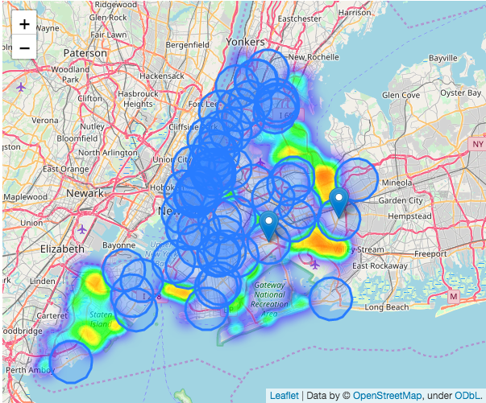
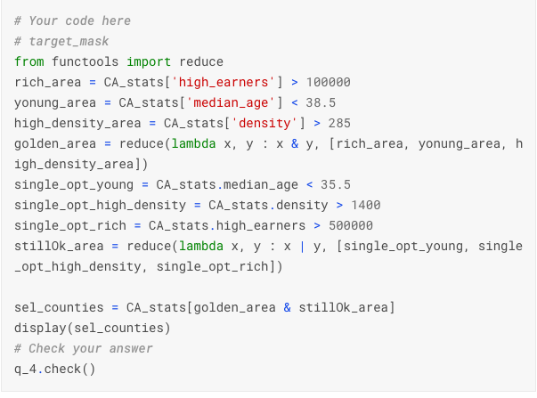
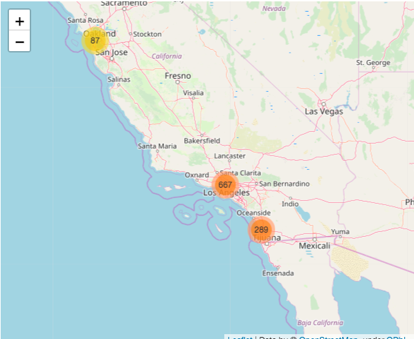
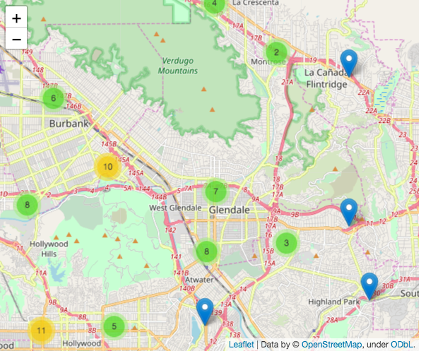

# Geospatial Analysis 
* 紀錄Kaggle Learning的Geospatial Analysis課程，並且copy一份下來，就不會因為Kaggle learn收回課程而無從參考
TODO [use git to display the html page](https://www.finex.co/how-to-display-html-in-github/)
# Summary


### Proximity Analysis
[Notebook on Kaggle](https://www.kaggle.com/ylt0609/exercise-proximity-analysis)
* 鄰近點分析
* 快速使用`folium` HeatMap進行探索
* 計算距離
  * 確認CRS一致
  * GeoDataFrame.geometry.distance(anotherGeoDataFrame.geometry)
  * 單位 -> 看文件
* 以半徑畫圓(create a buffer)
  * GeoDataFrame.geometry.buffer 會產生一個gpd.Series 為* POLYGON 畫圖的部分
  * 先畫中心點 MARKER POINT
  * 再畫POLYGON GeoJson(nuffer.to_crs(your_crs)).add_to(m)
* 收納buffer的方式
  * MultiPolygon
  * 形成一個MultiPolygon之後能夠用來計算是否包含某個點，我們就可以做鄰近點分析
* 透過上述分析，可以找出最應該蓋醫院的候選名單
  * 以車禍地理資料來描述醫院其中一項需求，並用HeatMap表示各州各區域的車禍密度
  * 以各周個區域醫院畫點，並拉出10km的buffer
  * 疊圖! buffer的顏色將HeatMap的顏色蓋掉，如此一來清晰可見哪些地方還是紅色的，在那些地方發生車禍時，醫院很遠，超過10km
  * 按照上圖建議醫院新建地點
  * 並計算新建前，新建後，預估的指標下降多少
  * 這裡的指標使用 $$\frac{number~of~車禍發生在最近醫院10km外}{number~of~所有車禍數}$$
  * 上述分析能夠被擴建，各方修改
  </img>

### Manipulating Geospatial Data
[Notebook on Kaggle](https://www.kaggle.com/ylt0609/exercise-manipulating-geospatial-data)

* geocode : 從地理座標位置 <---> 地址，地標, based on google map, Bing Maps, Baidu Maps
  * provide name / adress (Python string)
* API provider, goole map, BIng Maps, Baidu Maps,...
  * Here we use OpenStreetMap
* return
  * geometry ( latitude, longitude )
  * adress ( full adress )
* GeoDataFrame ,DataFrame JOIN

|Type|Use|
|----|---|
|string-string|join, merge|
|geometry-geometry|sjoin|

星巴克的資料分析師，透過Data來決定展店地點/實驗店地點
1. 讀取美國所有星巴克候選地點資料，包含StoreNumber，Store Name，地址，城市，經緯度，為DataFrame，這裡指的候選地點意思是，有店主期望在這些地點展店，現在總公司要進行評估哪些地方適合哪些地方不適合
2. 有missing的經緯度，透過`geopandas.tools.geocode`輸入地址來得到經緯度位置，API Provider為OpenMap，注意，geocode也有可能不對，這裡會有誤差傳遞
3. 想要展店要考慮的另一份人口統計資料，以美國西岸`California`洲為例，目前在該州內，只有`Berkeley`開了6間店，但在這個州，有更多其他具有潛力的開店點
4. 初步考量，我們要考慮加州各城市的
   * 人口密度 : 來店人數多寡
   * 年齡層 : 命中星巴克的目標族群
   * 經濟水準 : 命中星巴克的目標族群 
因此，參考三份Data，得出人口密度，中位數年齡，以及收入，表格join
接著按照想要的人口密度，要命中的年齡區間，年收入水準進行過濾，也可以是多種標準，這裡規劃了gold_costumer(三項目都超越標準)以及normal_costumer(單項超越標準)
    </img>
5. 最終過濾出了3個城市，非常符合條件(geometry為polygon)

6. 區域的GeoDataFrame為POLYGON，星巴克各點為POINT，使用sjoin，就可以找出3個城市中的所有地點，使用MakerCluster()來畫圖，就不會一大堆Point，Zoom in 時還可以拆分

</img>
</img>

### Interactive Map
[Kaggle Notebook](https://www.kaggle.com/alexisbcook/interactive-maps)
互動式的介面自己做EDA或是展示都相當方便，特別舉例地圖資料的話，還能夠當場互動選定地點(包含了解附近商圈關係，以及精確經緯度)，甚至也可以搭配上兩張提到的，即時反饋選定區域能夠帶來多少經濟效益，或是展店覆蓋度等
package : `folium`
利用下列function將結果embed在html中，backend想當然爾就是JavaScript
```
# Function for displaying the map
def embed_map(m, file_name):
    from IPython.display import IFrame
    m.save(file_name)
    return IFrame(file_name, width='100%', height='500px')
```
* PointPlot : `folium.Marker` : 放置地標點 : 地點展示
* 缺點 : 點太密集時有效能問題，遇到這個情況時使用MarkerCluster
基本上也不太適合太多點的展示，因為要用iterrows一個一個畫上去，只要使用DataFrame的經緯度即可，不需要GeoDataFrame的geometry，精確度最好可以在小數點下6位

* PointPlot : `folium.ClusterMarker` : 太多點的時候使用，會加總附近有幾個點，zoom in時在切分開來，遠看和近看都能夠充分顯示資訊

* PointPlot : `folium.Circle` : 圓點方式，比起Marker的優勢點在於，顏色、Circle大小是兩個可控制的Dimension，例如犯罪地點 9-12時標示為綠色，13-17標示為藍色

* HeatMap : `folium.HeatMap` : 展示密度，你的點真的太多了，就用density吧，一目了然哪邊比較多人犯罪，哪邊比較多我們的商業目標等

* HeatMap : `folium.Choroleth` : 同樣是HeatMap，但能夠針對特定區塊(例如國家，州，區，城市分塊展示)，優勢點在於能夠展示各州/各區索索擁有的資源等等，需要使用`GeoDataFrame`